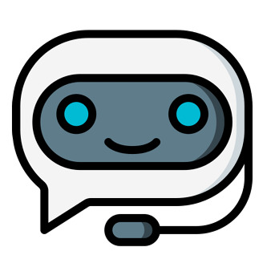

# 드론과 Vision AI를 활용한 캠퍼스 건물 외벽 손상 탐지
##  Airovision: 서버(with LLaVA) - Discord Chatbot

1) 드론이 촬영한 건물 손상 이미지를 서버로 전송하고,  
2) LLaVA(VLM) 분석 결과와 보수 상태를 관리하며,  
3) Discord 챗봇·Google Calendar·AWS S3와 연동하는 프로젝트입니다.

---
## 📌 주요 기능
**1. 클라이언트로부터 손상 이미지 받기**
  - 클라이언트로부터 `/upload-img`로 이미지를 전송받고 S3에 저장 후 이미지 url을 클라이언트에게 반환합니다.
  - S3가 아닌 로컬 환경에 이미지를 저장하고 싶다면 `/upload-img-dev`로 전송하고 이미지 경로를 반환합니다.

**2. 클라이언트로부터 손상 정보 받기**
- 클라이언트는 이미지 url을 포함한 손상이미지에 대한 데이터를 `/defect-info`로 전송합니다.
- request body
  
  ```json
  {
		"latitude": 17.3595704,
		"longitude": 128.105399,
		"image" : "image url",
		"detect_time": "2025-11-10 11:40:20"
  }
  
- response body 예시
  
  ```json
  {
      "id": "defect_id",
      "latitude": 37.4503,
      "longitude": 126.654,
      "image": "image_url.jpg",
      "detect_time": "2025-11-17 15:22:20",
      "defect_type": "철근 노출",
      "urgency": "높음",
      "address": "인천 미추홀구 인하로 100, 인하대학교"
  }

**3. LLaVA의 손상 유형 분석 및 알림 전송**
- 해당 데이터를 통해 LLaVA는 손상 유형(콘크리트 균열, 도장 손상, 철근 노축)과 위험도(높음, 중간, 낮음)을 분석하여 디스코드 챗봇을 통해 알림을 손상 알림을 전송합니다.

**4. 추가 질문을 통한 상호작용**
- 클라이언트는 챗봇에 나와있는 질문 버튼을 통해 추가적인 정보를 제공 받습니다.
  
  ```bash
  1. 이미지에 나타난 손상에 대해 분석 요약해주세요  # LLaVA를 통해 손상 이미지 묘사 및 분석 답변
  2. 어떤 조치가 필요할지 조언해주세요           # LLaVA를 통한 답변
  3. 모든 손상 기록을 조회할게요               # 데이터베이스에 존재하는 손상들을 위험도 순으로 조회
  4. 캘린더에 보수 공사 일정을 추가할게요        # 구글 캘린더와 연동하여 보수공사 일정 추가
- 보수 공사 진행중, 완료 등과 같이 보수 진행 현황도 함께 관리하는 기능을 제공합니다.
  
## 🛠️ 기술 스택

- Python 3.x  
- FastAPI (REST API 서버)
- Discord.py (Discord 챗봇)
- SQLite (경량 DB)
- Google Calendar API
- AWS S3 (이미지 스토리지)
- LLaVA 서버 연동 (멀티모달 분석)
- 기타 의존성: `requirements.txt` 참고

## 💻 GPU 환경 (CUDA / MPS 지원)

이 프로젝트에서 사용하는 PyTorch 기반 모델은 **GPU 가속**을 지원하며, 아래 두 가지 환경을 모두 사용할 수 있습니다.

- **CUDA (NVIDIA GPU)**  
  - Linux / Windows 환경에서 NVIDIA GPU와 CUDA 드라이버가 설치되어 있으면 자동으로 `cuda` 디바이스를 사용합니다.
- **MPS (Apple Silicon / Metal Performance Shaders)**  
  - macOS에서 Apple Silicon(M1/M2/M3) 및 최신 PyTorch 버전을 사용할 경우 `mps` 디바이스를 통해 GPU 가속을 사용할 수 있습니다.

디바이스 선택 코드는 다음과 같이 구성을 확인할 수 있습니다.

```python
## llava.py
import torch

if torch.cuda.is_available():
    device = torch.device("cuda")
elif torch.backends.mps.is_available():
    device = torch.device("mps")
else:
    device = torch.device("cpu")

print("Using device:", device)
```
- GPU가 없는 환경에서는 자동으로 CPU 모드로 동작합니다.

## 📂 파일 / 디렉토리 구조

  ```bash
  .
  ├── images/           # 프로젝트에서 사용하는 이미지 리소스 (문서/테스트용)
  ├── airobot.py        # Discord 챗봇 진입점 및 명령어/버튼 로직
  ├── config.py         # 환경변수, API 키, 공통 설정값 관리
  ├── database.py       # SQLite DB 연결, 초기화, 공통 쿼리 유틸
  ├── google_token.py   # Google OAuth 토큰 관리 (발급/갱신/저장)
  ├── llava.py          # LLaVA 서버 연동 및 프롬프트/응답 처리 로직
  ├── main.py           # FastAPI 메인 엔트리 (라우팅, Swagger, 서버 실행)
  ├── map.py            # 위치/지도/주소 및 일정·보수 상태 매핑 관련 유틸
  ├── models.py         # Pydantic / ORM 모델 정의 (Defect, Record, Calendar 등)
  ├── record.py         # 점검·보수 기록 및 캘린더 일정 세부 로직
  ├── s3_utils.py       # AWS S3 업로드/다운로드 및 URL 생성 유틸
  ├── requirements.txt  # Python 패키지 의존성 목록
  └── .gitignore        # Git 버전관리 제외 파일 설정
  ```
---
## 📍 실행하기
#### 1. ⚙️ 환경 변수 설정
- 프로그램을 실행하기 전에 프로젝트 루트에 `.env` 파일을 먼저 생성해야 합니다.  
  아래 형식으로 값을 채워 넣어 주세요.

  ```bash
  DISCORD="******"             # Discord 봇 토큰
  NAVER_CLIENT_ID="*****"      # 네이버 API Client ID
  NAVER_CLIENT_SECRET="*****"  # 네이버 API Client Secret
  
  AWS_REGION="ap-northeast-2"  # 예시 리전, 실제 사용 리전으로 변경
  AWS_S3_BUCKET="****"         # 사용 중인 S3 버킷 이름
  ```
- `airbot.py` 파일에서 `CHANNEL_ID`에 원하는 디스코드 채널의 ID 값을 넣어주세요.

#### 2. 📦 가상환경 활성화 및 패키지 설치
- 가상환경을 키고, `requirements.txt`를 필요한 패키지를 설치하세요.
  
  ```bash
  # 1) 가상환경 활성화
  source {가상환경 이름}/bin/activate

  # 2) 패키지 설치
  pip install -r requirements.txt
  ```
  
#### 3. 🎬 메인함수 실행하기
- `main.py`를 함수를 아래 명령어를 통해 실행해주세요
  
  ```bash
  # 3) 프로그램 시작
  uvicorn main:app --reload
  ```

